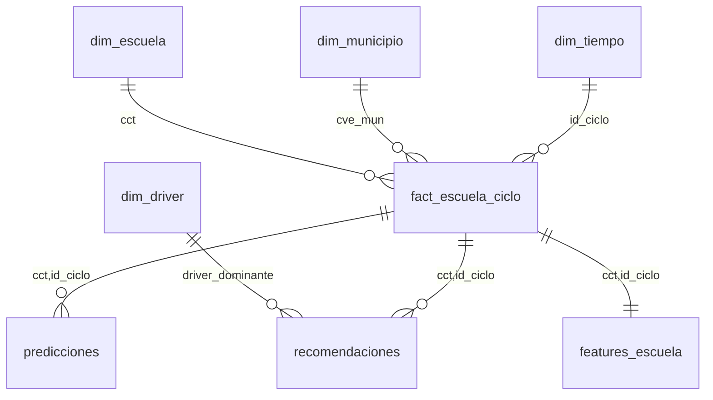

# Data Model — Arquitectura Medallón FARO

> Schema **canónico** del proyecto. Cambios aquí requieren **revisión humana explícita** (regla 7 del
> vault) y actualización de las suites de Great Expectations y de los contratos Pydantic.
> Implementa **REQ-001** ([[02_Requirements/Requirements_Detailed]]). Fuentes: [[14_Data_Sources/_index]].
> → [[03_Architecture/_index]] · [[01_Product/PRD]]

---

## 1. Principios de diseño

| Capa | Qué **SÍ** vive aquí | Qué **NO** vive aquí |
|---|---|---|
| **Bronze** | Copia cruda 1:1 de la fuente + metadatos de ingesta. Nacional. | Transformaciones, tipados, joins, filtros de alcance. |
| **Silver** | Datos tipados, deduplicados, con CCT y clave INEGI homologados y `SIN_DATO` resuelto. Nacional. | Agregaciones de negocio, esquema estrella, features de ML. |
| **Gold** | Esquema estrella, cubos, features, predicciones y recomendaciones. **Acotado a `SCOPE_ENTIDADES`**. | Datos crudos; lógica de limpieza (ya resuelta en Silver). |

Reglas transversales:
- **Idempotencia:** reprocesar una capa no duplica filas (llaves naturales + `MERGE`/upsert).
- **Trazabilidad:** todo registro conserva su linaje hasta la fuente (`_source`, `_source_url`).
- **`SIN_DATO` explícito:** la ausencia de dato **nunca** es cero ni nulo silencioso (ver §3).
- **La escuela es la unidad mínima; jamás el alumno** (privacidad por diseño).

---

## 2. BRONZE — landing crudo

- **Una tabla por fuente**, sin transformar (los tipos pueden ser todos `string` si la fuente lo entrega así).
- **Formato Parquet**, **particionado por fecha de ingesta** (`_ingested_at` → `dt=YYYY-MM-DD`).
- **Metadatos obligatorios** en cada tabla:

| Columna | Tipo | Descripción |
|---|---|---|
| `_ingested_at` | timestamp | Momento de la ingesta (UTC). Clave de partición. |
| `_source` | string | ID de la fuente (`DS-01`…`DS-08`). |
| `_source_url` | string | URL o endpoint exacto del que se descargó. |

- **Nomenclatura:** `bronze.<fuente>_<periodo>` — p. ej. `bronze.formato911_2023_2024`,
  `bronze.sesnsp_2026_07`, `bronze.sinaica_2026_08_03`.
- **Cobertura:** **nacional** (todas las entidades). No se filtra por `SCOPE_ENTIDADES` aquí.

| Tabla Bronze | Fuente | Frecuencia de partición |
|---|---|---|
| `bronze.formato911_<ciclo>` | DS-01 | anual |
| `bronze.cct_<fecha>` | DS-02 | continua (snapshot) |
| `bronze.cemabe_2013` | DS-03 | censo (única) |
| `bronze.sesnsp_<aaaa_mm>` | DS-04 | mensual |
| `bronze.sinaica_<fecha>` | DS-05 | horaria → consolidado diario |
| `bronze.conagua_<fecha>` | DS-06 | diaria |
| `bronze.coneval_<aaaa>` | DS-07 | bienal |
| `bronze.conapo_<aaaa>` | DS-08 | anual |

---

## 3. SILVER — limpio y conformado

Transformaciones (dbt) sobre Bronze, **nacional**:

1. **Tipado explícito** de cada columna (int, float, bool, date, string).
2. **Deduplicación** por llave natural de cada fuente.
3. **Homologación de CCT** a 10 caracteres (ceros a la izquierda, mayúsculas).
4. **Homologación de clave INEGI de municipio a 5 dígitos** (`cve_ent`(2)+`cve_mun`(3)).
5. **Resolución de cobertura parcial** — regla `SIN_DATO`:
   - Donde una fuente **no cubre** una escuela/municipio, el valor del driver se marca como
     **`SIN_DATO`** (categoría explícita), **nunca `0` ni `NULL` silencioso**.
   - Para D5/D6 (SINAICA, CONAGUA) se interpola por **IDW** dentro de un radio válido; **fuera del
     radio → `SIN_DATO`**, y se registra un `indice_confianza` de la interpolación.

Nomenclatura: `silver.<entidad_conformada>` — `silver.matricula`, `silver.escuela`, `silver.cemabe`,
`silver.delitos_municipio`, `silver.aire_estacion`, `silver.agua_region`, `silver.rezago_municipio`,
`silver.poblacion_municipio`.

> **Convención de nulos:** en Silver, `NULL` solo es válido en columnas donde la ausencia es
> estructural y documentada. Para drivers y métricas de cobertura, la ausencia se codifica con el
> centinela `SIN_DATO`.

---

## 4. GOLD — esquema estrella

**Acotado a `SCOPE_ENTIDADES = ["09","15","19","14"]`** (CDMX, Edomex, Nuevo León, Jalisco).



### 4.1 `gold.fact_escuela_ciclo` — hecho central
- **Grano:** una fila por **CCT × ciclo escolar**.
- **Llaves foráneas:** `cct` → `dim_escuela`, `id_ciclo` → `dim_tiempo`, `cve_mun` → `dim_municipio`.
- **Métricas:** `matricula_total`, `variacion_matricula`, `indice_completitud_drivers`, y los seis
  scores de driver `d1`…`d6` (cada uno con su bandera de cobertura `d#_cobertura`).
- **Principio de diseño:** esta tabla contiene únicamente **hechos observados**, disponibles desde
  Silver sin depender de ningún modelo. Las salidas de ML (`indice_riesgo` en `gold.predicciones`,
  `driver_dominante` en `gold.recomendaciones`) **no viven aquí** — se consultan vía `JOIN` por
  `cct, id_ciclo` al construir los cubos de Superset (§4.3). Esto evita duplicar la misma información
  en tres tablas y desacopla la entrega de esta historia (S1/S3) del sprint de ML (S4).

### 4.2 Dimensiones
- **`dim_escuela`** — `cct` (PK), `nombre`, `nivel`, `sostenimiento`, `latitud`, `longitud`,
  `cve_ent`, `cve_mun`, e infraestructura CEMABE: `agua`, `drenaje`, `electricidad`, `sanitarios`,
  `internet`, `computadoras`.
- **`dim_municipio`** — `cve_mun` (PK, 5), `cve_ent`, `nombre_municipio`, `nombre_entidad`,
  `poblacion`, `indice_rezago_social`, `grado_rezago`, `pobreza_pct`.
- **`dim_tiempo`** — `id_ciclo` (PK), `ciclo` (`2023-2024`), `anio_inicio`, `anio_fin`.
- **`dim_driver`** — `id_driver` (`D1`…`D6`), `nombre`, `descripcion`, `fuente`, `cobertura`,
  `nivel_geografico`.

### 4.3 Cubos materializados (para los 10 dashboards)
Agregaciones precalculadas para que Superset responda rápido. Cada cubo expone su **bandera de
cobertura**. Mapa cubo → dashboard:

| Cubo | Alimenta | Grano |
|---|---|---|
| `gold.cubo_matricula` | DB-01, DB-06 | entidad × municipio × ciclo |
| `gold.cubo_riesgo_territorial` | DB-02 | municipio × ciclo |
| `gold.cubo_escuela_360` | DB-03 | cct × ciclo |
| `gold.cubo_comparador_municipio` | DB-04 | municipio × nivel × ciclo |
| `gold.cubo_driver` | DB-05 | driver × municipio × ciclo |
| `gold.cubo_completitud` | DB-07 | municipio × driver × ciclo |
| `gold.cubo_pivot` | DB-08 | cct × driver × ciclo (base pivotable) |
| `gold.cubo_recomendaciones` | DB-09 | cct × ciclo |
| `gold.cubo_pipeline` | DB-10 | fuente × fecha_ingesta |
> **Nota de diseño — `cubo_comparador_municipio`:** el grano original (`municipio × ciclo`)
> pre-agregaba antes de poder aplicar el filtro global por nivel educativo de AC-002.2 (DB-04),
> y un cubo ya agregado no se puede desagregar después. Se bajó el grano a
> `municipio × nivel × ciclo` y las métricas se almacenan como **numerador y denominador por
> separado** (no como razón/ratio precalculada), para que cualquier filtro downstream reagregue
> correctamente — mismo principio de medidas aditivas crudas de `fact_escuela_ciclo`.
> Decisión de esquema tomada por Diana Alvarez Varela (Tech Lead Célula 1, regla 7) el 14 ago
> 2026, a partir del hallazgo de Marina García en US-211a. Registrada como **DEC-008**.

### 4.4 `gold.features_escuela` — contrato con la Célula 3
- **Grano:** una fila por **CCT × ciclo**. Los 6 drivers **normalizados** (0–1) + banderas de cobertura
  + el target de entrenamiento. Contrato **cerrado y versionado** (ver §5.3).

### 4.5 Salida de modelos
- **`gold.predicciones`** — `cct`, `id_ciclo`, `modelo` (`ML-01`/`ML-02`/`ML-03`), `valor`
  (variación cruda, para métricas MAE/RMSE de ML-01), **`indice_riesgo`** (float[0,1], columna
  derivada calculada en `src/modelos/riesgo.py`), `probabilidad`, `mlflow_run_id`, `generado_at`.
- **`gold.recomendaciones`** — `cct`, `id_ciclo`, `driver_dominante`, `recomendacion`, `prioridad`.

---

## 5. Contratos de datos con Pydantic

### 5.1 Un modelo por tabla de Silver y de Gold
Cada tabla tiene un modelo Pydantic con **tipos estrictos** que sirve de contrato ejecutable. Ejemplos:

```python
from datetime import datetime
from enum import Enum
from pydantic import BaseModel, Field, StrictInt, StrictStr, StrictFloat

class Cobertura(str, Enum):
    OK = "OK"
    SIN_DATO = "SIN_DATO"        # ausencia explícita: nunca 0, nunca None silencioso

class SilverMatricula(BaseModel):
    cct: StrictStr = Field(min_length=10, max_length=10)
    ciclo: StrictStr                          # p. ej. "2023-2024"
    cve_mun: StrictStr = Field(min_length=5, max_length=5)
    matricula_total: StrictInt = Field(ge=0)
    _source: StrictStr
    _ingested_at: datetime

class FactEscuelaCiclo(BaseModel):
    cct: StrictStr = Field(min_length=10, max_length=10)
    id_ciclo: StrictStr
    cve_mun: StrictStr = Field(min_length=5, max_length=5)
    matricula_total: StrictInt = Field(ge=0)
    variacion_matricula: StrictFloat
    indice_completitud_drivers: StrictFloat = Field(ge=0, le=1)
```

### 5.2 Pydantic en la INGESTA vs Great Expectations por CAPA (complementarios)

| | **Pydantic** | **Great Expectations** |
|---|---|---|
| **Cuándo** | En la **ingesta**, registro por registro, al entrar a Bronze/Silver. | Al **cerrar una capa**, sobre el **conjunto** de la tabla. |
| **Qué valida** | Forma y tipo de **cada fila**: tipos estrictos, rangos, longitud de CCT, enums (`SIN_DATO`). | Propiedades del **dataset**: % de nulos, unicidad de la llave, cardinalidad, distribuciones, integridad referencial. |
| **Falla** | Rechaza/aísla el **registro** malformado antes de persistir. | Marca la **suite** en rojo y frena la promoción de la capa. |

**Por qué no son redundantes:** Pydantic garantiza que *ningún registro individual* entre mal
tipado (una fila con CCT de 7 caracteres se rechaza en la puerta); Great Expectations garantiza
propiedades que **solo existen a nivel de conjunto** y que Pydantic no puede ver fila por fila (que
`cct` sea **único** en la tabla, que los duplicados no superen un umbral, que la distribución de
`matricula_total` no se desplace entre ciclos). Uno cuida el registro; el otro, la población.

### 5.3 `FeaturesEscuela` — contrato formal Célula 1 ↔ Célula 3
El modelo Pydantic de `gold.features_escuela` es el **contrato versionado** entre Data Engineering
(produce) y ML (consume). Cambiar una columna = cambiar el contrato = PR con aviso a la Célula 3.

```python
class FeaturesEscuela(BaseModel):
    model_config = {"extra": "forbid"}         # ninguna columna fuera de contrato
    cct: StrictStr = Field(min_length=10, max_length=10)
    id_ciclo: StrictStr
    d1_pobreza: StrictFloat | None = Field(ge=0, le=1)      # None ⇒ ver *_cobertura
    d2_inseguridad: StrictFloat | None = Field(ge=0, le=1)
    d3_infraestructura: StrictFloat | None = Field(ge=0, le=1)
    d4_conectividad: StrictFloat | None = Field(ge=0, le=1)
    d5_agua: StrictFloat | None = Field(ge=0, le=1)
    d6_aire: StrictFloat | None = Field(ge=0, le=1)
    d1_cobertura: Cobertura
    d2_cobertura: Cobertura
    d3_cobertura: Cobertura
    d4_cobertura: Cobertura
    d5_cobertura: Cobertura
    d6_cobertura: Cobertura
    indice_completitud_drivers: StrictFloat = Field(ge=0, le=1)
    target_variacion_matricula: StrictFloat                 # etiqueta (partición temporal)
```

### 5.4 Configuración con `pydantic-settings`
Los parámetros del pipeline se leen de variables de entorno (`.env` nunca se sube), no se hardcodean:

```python
from pydantic_settings import BaseSettings

class Settings(BaseSettings):
    scope_entidades: list[str] = ["09", "15", "19", "14"]
    postgres_dsn: str
    idw_radio_km: float = 20.0
    model_config = {"env_file": ".env", "env_prefix": "FARO_"}
```

---

## 6. Diccionario de datos (Gold)

### `gold.fact_escuela_ciclo`
| Columna | Tipo | Descripción | Origen | Nulos |
|---|---|---|---|---|
| `cct` | str(10) | Llave de escuela | DS-02 / DS-01 | No |
| `id_ciclo` | str | Ciclo escolar | DS-01 | No |
| `cve_mun` | str(5) | Clave INEGI municipio | DS-02 | No |
| `matricula_total` | int | Matrícula del ciclo | DS-01 | No |
| `variacion_matricula` | float | Δ vs ciclo anterior | derivado | No |
| `indice_completitud_drivers` | float[0,1] | Fracción de drivers observados | derivado | No |
| `d1`…`d6` | float\|SIN_DATO | Score por driver | Silver | Sí (centinela `SIN_DATO`) |
| `d1_cobertura`…`d6_cobertura` | enum | OK / SIN_DATO | derivado | No |

> **Nota:** `indice_riesgo` vive en `gold.predicciones` (columna `valor`, `modelo = 'ML-01'`) y
> `driver_dominante` vive en `gold.recomendaciones`. Se consultan por `JOIN` con `cct, id_ciclo`,
> no se duplican aquí (ver §4.1).

### `gold.dim_escuela`
| Columna | Tipo | Descripción | Origen | Nulos |
|---|---|---|---|---|
| `cct` | str(10) | PK escuela | DS-02 | No |
| `nombre` | str | Nombre del plantel | DS-02 | No |
| `nivel` | str | Nivel educativo | DS-02 | No |
| `sostenimiento` | str | Público/privado | DS-02 | No |
| `latitud` / `longitud` | float | Georreferencia | DS-02 | Sí |
| `cve_ent` / `cve_mun` | str | Claves INEGI | DS-02 | No |
| `agua`,`drenaje`,`electricidad`,`sanitarios`,`internet`,`computadoras` | bool/int\|SIN_DATO | Infraestructura | DS-03 | Sí (`SIN_DATO`) |

### `gold.dim_municipio`
| Columna | Tipo | Descripción | Origen | Nulos |
|---|---|---|---|---|
| `cve_mun` | str(5) | PK municipio | DS-02/DS-07 | No |
| `cve_ent` | str(2) | Entidad | DS-07 | No |
| `nombre_municipio` / `nombre_entidad` | str | Nombres | DS-07 | No |
| `poblacion` | int | Población (denominador) | DS-08 | No |
| `indice_rezago_social` | float | Índice CONEVAL | DS-07 | Sí (`SIN_DATO`) |
| `grado_rezago` | str | Categoría | DS-07 | Sí |
| `pobreza_pct` | float | % en pobreza | DS-07 | Sí |

### `gold.dim_tiempo`
| Columna | Tipo | Descripción | Origen | Nulos |
|---|---|---|---|---|
| `id_ciclo` | str | PK ciclo | DS-01 | No |
| `ciclo` | str | `2023-2024` | DS-01 | No |
| `anio_inicio` / `anio_fin` | int | Años del ciclo | derivado | No |

### `gold.dim_driver`
| Columna | Tipo | Descripción | Origen | Nulos |
|---|---|---|---|---|
| `id_driver` | str | `D1`…`D6` | catálogo | No |
| `nombre` | str | Nombre del driver | catálogo | No |
| `fuente` | str | DS que lo alimenta | catálogo | No |
| `cobertura` | str | Nacional/Regional/Parcial | catálogo | No |
| `nivel_geografico` | str | escuela / municipio / región | catálogo | No |

### `gold.features_escuela` · `gold.predicciones` · `gold.recomendaciones`
Ver el contrato Pydantic en §5.1 y §5.3; el diccionario de columnas coincide 1:1 con esos modelos.

---

## 7. Manejo de `SCOPE_ENTIDADES`

- **Dónde:** el filtro `WHERE cve_ent IN SCOPE_ENTIDADES` se aplica **únicamente en la frontera
  Silver → Gold** (y en features/modelos/dashboards que derivan de Gold).
- **Por qué en Gold y no antes:**
  1. **Nacional por diseño:** Bronze y Silver conservan el país completo; el proyecto se acota por
     **cobertura de datos, no por capacidad**. Ampliar a 32 entidades es cambiar una línea, sin
     reingestar.
  2. **El análisis de vacíos (DB-07) necesita contexto nacional:** `indice_completitud_drivers` y el
     mapa de `SIN_DATO` pierden sentido si se recorta la población antes de medirla.
  3. **Reproducibilidad:** filtrar tarde mantiene Silver como una base reutilizable y auditable para
     cualquier alcance futuro.

---

## 8. Linaje (fuente → dashboard)

```
DS-01..DS-08
   │  (extractores idempotentes + _ingested_at/_source/_source_url)
   ▼
BRONZE  bronze.<fuente>_<periodo>        (Parquet, particionado por dt, NACIONAL)
   │  (dbt: tipado, dedupe, CCT + INEGI 5 díg., SIN_DATO, IDW)
   ▼
SILVER  silver.<entidad_conformada>      (limpio y conformado, NACIONAL)
   │  (dbt: esquema estrella + filtro SCOPE_ENTIDADES)
   ▼
GOLD    fact_escuela_ciclo + dims + cubos   (estrella, 4 ENTIDADES)
   │
   ├──► gold.features_escuela  ──►  ML-01 / ML-02 / ML-03 (MLflow, partición temporal)
   │                                    │
   │                                    ▼
   │                          gold.predicciones + gold.recomendaciones
   ▼
CUBOS materializados  ──►  Superset DB-01 … DB-10
```

---

## 9. Convenciones de nomenclatura

- **Esquemas/capas:** `bronze.` · `silver.` · `gold.` (prefijo por capa).
- **Bronze:** `bronze.<fuente>_<periodo>` (fuente en minúsculas, periodo según frecuencia).
- **Silver:** `silver.<entidad_conformada>` en singular (`silver.escuela`, `silver.matricula`).
- **Gold:** hechos `fact_<grano>`, dimensiones `dim_<entidad>`, cubos `cubo_<tema>`, derivados
  descriptivos (`features_escuela`, `predicciones`, `recomendaciones`).
- **Columnas:** `snake_case`, sin acentos. Claves: `cct` (10), `cve_ent` (2), `cve_mun` (5),
  `id_ciclo`, `id_driver`. Banderas de cobertura: `<driver>_cobertura`. Metadatos con guion bajo
  inicial: `_ingested_at`, `_source`, `_source_url`, `_loaded_at`.
- **Centinela:** `SIN_DATO` (mayúsculas) para ausencia explícita de dato.
