# Linaje de datos completo — fuente → dashboard (US-106)

> Diagrama de linaje **nodo por nodo** de las 8 fuentes hasta los 10 dashboards, y la declaración de
> **freeze** del esquema Gold. Complementa el linaje de capas (alto nivel) de
> [[vault/03_Architecture/Data_Model#8-linaje-fuente-dashboard|Data_Model §8]] — este documento es el
> **detalle completo**, objeto propio de **US-106**.
> → [[vault/03_Architecture/Data_Model]] · [[vault/03_Architecture/_index]]

---

## 1. Estado de este documento

**`status: approved`** — freeze declarado el **2026-09-04**, dos días antes del objetivo original
del Sprint S5 (6-sep). Los pendientes de la §4 que bloqueaban la declaración (BUG-009, el PR de
Monserrat) ya se cerraron; **RISK-008** (`coneval_periodo_medicion`) sigue abierto como deuda
técnica aceptada explícitamente en DEC-011, no como algo confirmado — ver la última fila del
checklist de §4 para el detalle completo.

## 2. Cómo leer el diagrama

Cada nodo es una tabla o artefacto real (no una capa). El color/forma indica su estado:

- **Materializado** — existe hoy como modelo dbt o tabla real, con datos.
- **Especificado, pendiente de materializar** — existe su contrato/SQL de referencia en el vault,
  pero la tabla real todavía no se construye en el pipeline (dbt o Superset).
- **Documental** — no es una tabla, es la fuente pública o la capa lógica.

```mermaid
flowchart TD
    subgraph FUENTES["Fuentes públicas (DS-01…DS-08)"]
        DS01["DS-01<br/>SEP Formato 911"]
        DS02["DS-02<br/>SEP Catálogo CCT"]
        DS03["DS-03<br/>SEP/INEGI CEMABE"]
        DS04["DS-04<br/>SESNSP Incidencia Delictiva"]
        DS05["DS-05<br/>SINAICA Calidad del Aire"]
        DS06["DS-06<br/>CONAGUA SINA"]
        DS07["DS-07<br/>CONEVAL Rezago Social"]
        DS08["DS-08<br/>CONAPO Proyecciones"]
    end

    subgraph BRONZE["BRONZE — crudo, nacional"]
        B_f911["bronze.formato911_2024_2025"]
        B_f911h["bronze.formato911_historico"]
        B_cct["bronze.cct_&lt;fecha&gt;<br/>(RISK-009: identifier real pendiente de fijar en sources.yml)"]
        B_cemabe["bronze.cemabe_2013"]
        B_sesnsp["bronze.sesnsp_&lt;aaaa_mm&gt;<br/>(BUG-009)"]
        B_sinObs["bronze.sinaica_observaciones<br/>(BUG-009)"]
        B_sinEst["bronze.sinaica_estaciones<br/>(BUG-009)"]
        B_conagua["bronze.conagua_&lt;fecha&gt;<br/>⚠️ sin datos ingeridos todavía"]
        B_coneval["bronze.coneval_&lt;aaaa&gt;<br/>(BUG-009 — 2 versiones sin reconciliar: test/v2)"]
        B_conapo["bronze.conapo_&lt;aaaa&gt;<br/>(BUG-009)"]
    end

    subgraph SILVER["SILVER — tipado, conformado, nacional"]
        S_matricula["silver.matricula"]
        S_matriculaHist["silver.matricula_historica<br/>(RISK-007/DEC-007)"]
        S_escuela["silver.escuela"]
        S_cemabe["silver.cemabe"]
        S_delitos["silver.delitos_municipio"]
        S_aire["silver.aire_estacion<br/>(IDW, ADR-006, D6)"]
        S_agua["silver.agua_region<br/>⚠️ bloqueado por BUG-009/DS-06"]
        S_rezago["silver.rezago_municipio"]
        S_poblacion["silver.poblacion_municipio"]
    end

    subgraph GOLD_CORE["GOLD — estrella (SCOPE_ENTIDADES)"]
        G_dimEscuela["gold.dim_escuela"]
        G_dimMunicipio["gold.dim_municipio"]
        G_dimTiempo["gold.dim_tiempo"]
        G_dimDriver["gold.dim_driver<br/>(catálogo, ADR-005)"]
        G_fact["gold.fact_escuela_ciclo<br/>(hecho central)"]
        G_features["gold.features_escuela<br/>(contrato C1↔C3, §5.3 Data_Model)"]
        G_matNivel["gold.matricula_municipio_nivel<br/>(RISK-007/DEC-007)"]
    end

    subgraph GOLD_CUBOS["GOLD — cubos materializados (§4.3 Data_Model)"]
        C_matricula["gold.cubo_matricula<br/>⏳ pendiente US-113 (Deni)<br/>SQL ref. mergeado (PR #71, Manuel)"]
        C_riesgo["gold.cubo_riesgo_territorial<br/>⏳ pendiente US-113<br/>SQL ref. mergeado (PR #71)"]
        C_360["gold.cubo_escuela_360<br/>✅ SQL semántico (db03)"]
        C_comparador["gold.cubo_comparador_municipio<br/>✅ SQL semántico (db04, DEC-008)"]
        C_driver["gold.cubo_driver<br/>⏳ pendiente US-211b (Monserrat, PR sin abrir)"]
        C_completitud["gold.cubo_completitud<br/>⏳ pendiente, sin SQL aún (DEC-009)"]
        C_pivot["gold.cubo_pivot<br/>⏳ pendiente"]
        C_recomendaciones["gold.cubo_recomendaciones<br/>⏳ pendiente"]
        C_pipeline["gold.cubo_pipeline<br/>⏳ pendiente"]
    end

    subgraph ML["ML — Célula 3 (MLflow, walk-forward, ADR-003)"]
        ML01["ML-01<br/>Regresión de matrícula"]
        ML02["ML-02<br/>Clasificación de driver dominante"]
        ML03["ML-03<br/>Clustering de escuelas"]
    end

    subgraph GOLD_ML["GOLD — salida de modelos"]
        G_pred["gold.predicciones<br/>(indice_riesgo, valor)"]
        G_reco["gold.recomendaciones<br/>(driver_dominante, prioridad)"]
    end

    subgraph DASHBOARDS["Superset — 10 dashboards"]
        DB01["DB-01 Ejecutivo"]
        DB02["DB-02 Mapa de riesgo territorial"]
        DB03["DB-03 Ficha de escuela"]
        DB04["DB-04 Comparador de municipios"]
        DB05["DB-05 Análisis por driver"]
        DB06["DB-06 Predicciones"]
        DB07["DB-07 Calidad y cobertura"]
        DB08["DB-08 Explorador del cubo"]
        DB09["DB-09 Recomendaciones prescriptivas"]
        DB10["DB-10 Monitor del pipeline"]
    end

    DS01 --> B_f911
    DS01 --> B_f911h
    DS02 --> B_cct
    DS03 --> B_cemabe
    DS04 --> B_sesnsp
    DS05 --> B_sinObs
    DS05 --> B_sinEst
    DS06 --> B_conagua
    DS07 --> B_coneval
    DS08 --> B_conapo

    B_f911 --> S_matricula
    B_f911h --> S_matriculaHist
    B_cct --> S_escuela
    B_cemabe --> S_cemabe
    B_sesnsp --> S_delitos
    B_sinObs --> S_aire
    B_sinEst --> S_aire
    B_conagua --> S_agua
    B_coneval --> S_rezago
    B_conapo --> S_poblacion

    S_escuela --> G_dimEscuela
    S_cemabe --> G_dimEscuela
    S_poblacion --> G_dimMunicipio
    S_rezago --> G_dimMunicipio
    S_matricula --> G_dimTiempo

    S_matricula --> G_fact
    G_dimEscuela --> G_fact
    S_cemabe --> G_fact
    S_rezago --> G_fact
    S_delitos --> G_fact
    S_aire --> G_fact
    S_agua -.-> G_fact

    S_matricula --> G_features
    G_dimEscuela --> G_features
    S_cemabe --> G_features
    S_rezago --> G_features
    S_delitos --> G_features
    S_aire --> G_features
    S_agua -.-> G_features

    S_matriculaHist --> G_matNivel

    G_fact --> C_matricula
    G_fact --> C_riesgo
    G_fact --> C_360
    G_dimDriver --> C_360
    G_fact --> C_comparador
    G_fact --> C_driver
    G_dimDriver --> C_driver
    G_fact --> C_completitud
    G_fact --> C_pivot
    G_dimDriver --> C_pivot

    G_features --> ML01
    G_features --> ML02
    G_features --> ML03

    ML01 --> G_pred
    ML03 --> G_pred
    ML02 --> G_reco

    G_pred --> C_recomendaciones
    G_reco --> C_recomendaciones
    G_reco --> C_driver

    B_f911 -.->|"metadatos de ingesta"| C_pipeline
    B_cct -.-> C_pipeline
    B_cemabe -.-> C_pipeline
    B_sesnsp -.-> C_pipeline
    B_sinObs -.-> C_pipeline
    B_coneval -.-> C_pipeline
    B_conapo -.-> C_pipeline

    C_matricula --> DB01
    C_matricula --> DB06
    C_riesgo --> DB02
    C_360 --> DB03
    C_comparador --> DB04
    C_driver --> DB05
    C_completitud --> DB07
    C_pivot --> DB08
    C_recomendaciones --> DB09
    C_pipeline --> DB10
```

> Líneas punteadas (`-.->`): dependencia condicionada o parcial — `silver.agua_region` alimenta
> `fact_escuela_ciclo`/`features_escuela` solo como `SIN_DATO` explícito mientras DS-06 siga sin
> datos reales (ver §3.5 y §4). Las flechas de metadatos hacia `cubo_pipeline` son de *lectura de
> `_ingested_at`/`_source`*, no de transformación de negocio.

---

## 3. Qué está materializado hoy (23-ago-2026) vs. qué falta

| Capa | Materializado | Pendiente |
|---|---|---|
| Bronze | 10/10 tablas reciben datos (aunque 7 sin `identifier` por default, BUG-009) | `conagua` sin ninguna tabla real ingerida |
| Silver | 8/9 modelos dbt construidos y probados | `agua_region` sin datos reales (depende de bronze conagua) |
| Gold — estrella | `dim_escuela`, `dim_municipio`, `dim_tiempo`, `fact_escuela_ciclo`, `features_escuela`, `matricula_municipio_nivel` — construidos, testeados (dbt tests nativos) | `dim_driver` es catálogo estático (ADR-005), no depende de pipeline |
| Gold — cubos | `cubo_escuela_360` y `cubo_comparador_municipio` tienen SQL semántico mergeado (Manuel, PR #71) | `cubo_matricula`, `cubo_riesgo_territorial` (SQL ref. mergeado, falta el cubo real — US-113, Deni); `cubo_driver` (SQL ref. en rama sin PR — US-211b, Monserrat); `cubo_completitud`, `cubo_pivot`, `cubo_recomendaciones`, `cubo_pipeline` sin construir |
| ML | Contratos y estrategia documentados (ADR-003, `vault/15_ML_Models/`) | Verificar en Célula 3 si `gold.predicciones`/`gold.recomendaciones` ya tienen corridas reales o siguen en fixture (`generar_fixture*.py`) |
| Gobernanza de esquema | DEC-008 (14-ago) y DEC-009 (23-ago) registradas y en `Data_Model.md` §4.3 | Confirmar que ambas están mergeadas a `main` antes del freeze |

## 4. Checklist para el freeze del 6 de septiembre

No declarar el freeze hasta que:

- [x] PR #74 (fix D6 IDW), #75 (DEC-009) y #76 (hallazgos BUG-009) estén mergeados a `main`
      — los tres mergeados el 2026-08-23, junto con #73, #77, #78 y #79
- [ ] Los 4 cubos de DEC-009 (`cubo_matricula`, `cubo_riesgo_territorial`, `cubo_driver`,
      `cubo_completitud`) estén materializados con el grano nuevo (US-113, Deni) o, si no alcanza
      el tiempo, quede documentado explícitamente como deuda técnica aceptada por Edgar
- [x] BUG-009 tenga default permanente en `sources.yml` (o, alternativa, se documenten los valores
      reales como configuración estándar del ambiente) — Edgar decide el reparto
      — cerrado por **DEC-011**: las 11 vars (no 7) con default permanente, identifiers inline en
      `sources.yml` y vars de modelo en `dbt_project.yml`; `dbt parse` en CI como test de regresión
- [ ] `coneval_periodo_medicion` esté confirmado por Deni (no el placeholder `2020`)
      — **sigue abierto**: `2020` quedó como deuda técnica aceptada explícitamente por Edgar Coronel
      (PM) en DEC-011, no como valor confirmado. Rastreado como **RISK-008** (dueña: Deni, fecha
      objetivo: 6-sep). Si no lo confirma antes del freeze, se declara con esta deuda a la vista, no
      cerrada en silencio. Incluye confirmar que `coneval_v2` es la tabla correcta y no `coneval_test`
- [x] El PR de Monserrat (`feat/monserrat-olivas-us211b-cubos-db05-db08`) esté abierto y su SQL de
      `cubo_driver` revisado — PR #73, revisado y aprobado por Manuel Serranía, mergeado el 2026-08-23
- [x] Este documento pase de `status: draft` a `status: approved` con fecha de freeze real
      — hecho 2026-09-04, con RISK-008 (`coneval_periodo_medicion`) declarado abierto y visible,
      no confirmado por Deni antes del freeze (deuda aceptada en DEC-011, no cerrada en silencio)

## 5. Qué significa "congelar" el esquema

A partir de la fecha de freeze, cualquier cambio a la forma de una tabla **Gold** (agregar,
quitar o renombrar columnas; cambiar el grano) deja de ser un ajuste normal de desarrollo y pasa a
requerir:

1. Un **ADR** o entrada en `vault/10_Risk_Governance/Decision_Log.md` (mismo criterio que DEC-008/DEC-009).
2. Revisión explícita de Diana Alvarez Varela (Tech Lead Célula 1, regla 7 del vault).
3. Aviso a las células consumidoras afectadas (**C2** Superset, **C3** ML, **C4** API) antes del
   merge, no después.

Esto **no** congela Bronze ni Silver — esas capas pueden seguir absorbiendo fuentes nuevas o
correcciones de calidad sin pasar por este proceso, mientras no cambien el contrato hacia Gold.

---

## 6. Ver también

- [[vault/03_Architecture/Data_Model|Data_Model.md]] — diccionario de columnas y contratos Pydantic completos
- [[vault/10_Risk_Governance/Decision_Log|Decision_Log]] — DEC-008, DEC-009
- [[vault/06_Quality_Testing/Bug_Register|Bug_Register]] — BUG-009
- [[vault/04_UX_Design/Screen_Specs|Screen_Specs]] — catálogo completo de KPIs por dashboard
- [[vault/15_ML_Models/ML_Strategy|ML_Strategy]] — ML-01/ML-02/ML-03