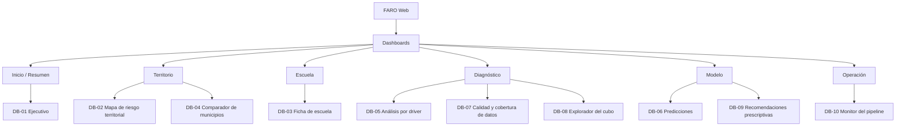
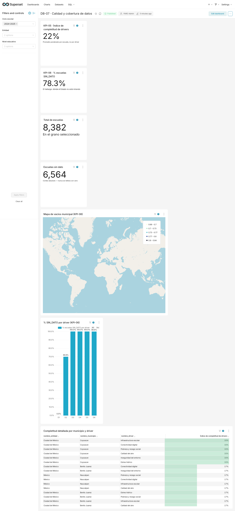

# Manual de Usuario — Dashboards FARO

> Guía en lenguaje de negocio de los 10 tableros de FARO, pensada para el equipo (onboarding
> rápido), el pitch de entrega y quien evalúe el proyecto. No repite el detalle técnico ya fijado
> en [[vault/04_UX_Design/Screen_Specs]] (SQL, grano, cubo Gold) — este documento explica **qué
> ve el usuario y qué decisión apoya cada tablero**.

## ⚠️ Estado de este manual (léelo antes de usarlo)

**Actualización 2026-09-04 — 10/10 con captura real.** El bloqueo de Bronze que motivó la primera
versión de este manual (2026-09-02) ya se resolvió para los 10 tableros: Diana Álvarez cargó CCT y
Formato 911 reales; Deni Garrido tiene el extractor oficial de CONEVAL; Emilio Galnares ya tenía
listo (desde el 28-ago, `done`) el extractor real de CONAGUA. Con `dbt run` completo, 23 de 24
modelos materializaron con datos reales (solo `silver.agua_region`/D5 sigue con placeholder
falso a propósito — BUG-030, decisión ya documentada del equipo, no relacionado con esto).

**Se encontró y corrigió un bug real en el sync** al registrar DB-10: `FORMATO_D3` en
`superset/sync_semantic_layer.py` no tenía entrada para `formato: fecha` — Superset rechazaba el
PUT completo del dataset y ninguna métrica se aplicaba. Corregido con prueba de regresión.

**Limitación real, visible en las 10 capturas:** `gold.predicciones` y `gold.recomendaciones`
(salidas de ML-01/ML-02) siguen siendo el mock sembrado en agosto, con CCT que no cruzan contra el
catálogo real de 77,712 escuelas recién cargado. Por eso todo lo que depende de predicciones o
recomendaciones muestra "No data"/SIN_DATO consistentemente — es una degradación correcta (R1: la
ficha no desaparece, dice "sin dato"), no un error de estos tableros. Refrescar el mock de ML
(o esperar las salidas reales de Célula 3) es lo único que falta para números completos.

| Dashboard | Estado de datos conocido |
|---|---|
| DB-01, DB-02, DB-03, DB-04, DB-05, DB-06, DB-08, DB-09 | **Vivos en Superset local con datos reales** (2026-09-03). KPIs de matrícula, drivers, infraestructura y territorio: reales. KPIs de predicción/recomendación (ML): SIN_DATO por el mock desactualizado, no por falta de dato real. |
| DB-07 | **Vivo con datos reales** (2026-09-02, reconfirmado 2026-09-03 con `dbt run` completo): 7/7 charts. El mapa carga pero el autozoom no centra en México — zoom manual pendiente. |
| DB-10 | **Vivo con datos reales** (2026-09-04): 1,296,326 filas, 8/8 fuentes con dato, 0 SIN_DATO. El tile "Última ingesta" muestra ".527ms" por un límite de formato de `big_number_total` en Superset (no un dato faltante) — ver nota en su sección. |

---

## 1. Cómo entrar

Los 10 tableros viven en Superset y se embeben en **FARO Web** (Streamlit) por guest token con
row-level security — no se navega a Superset directamente en producción
([[vault/03_Architecture/Frontend_Architecture]], ADR-002).

**En local (para desarrollo/pruebas):**
```bash
docker compose up -d db superset
# Superset queda en http://localhost:8088
```
Usuario y contraseña de administrador están en tu `.env` (`SUPERSET_ADMIN_USERNAME` /
`SUPERSET_ADMIN_PASSWORD`) — nunca los compartas ni los pegues en un prompt de IA.

**En producción:** la URL pública activa es la de la API
([https://faro-api-eanzfglvyq-uc.a.run.app](https://faro-api-eanzfglvyq-uc.a.run.app), ver
`README.md`). El despliegue de FARO Web con los dashboards embebidos es responsabilidad de
Célula 5 — confirma con Luis Téllez la URL vigente antes de una demo en vivo.

---

## 2. Los tres filtros que cambian todo

Cada tablero respeta los mismos tres filtros globales (AC-002.2), sincronizados entre sí — cambias
uno y se propaga a todos los tableros que abras después:

| Filtro | Qué hace | Nota |
|---|---|---|
| **Ciclo escolar** | Acota todo a un año escolar | Por default, el más reciente |
| **Entidad federativa** | CDMX, Edomex, Nuevo León o Jalisco | El proyecto es nacional por diseño; se acota a estas 4 por cobertura de datos, no por capacidad |
| **Nivel educativo** | Primaria, secundaria, media superior… | Vacío = todos los niveles |

**Regla que vas a ver repetida en cada tablero:** cuando un dato no existe, el tablero muestra
literalmente **`SIN_DATO`** — nunca un cero. Un municipio sin cobertura de un driver no desaparece
del mapa ni cae a 0: se dibuja como hueco. Esa distinción es el corazón del diferenciador del
proyecto (DB-07 la convierte en un hallazgo propio).

---

## 3. Mapa de navegación



Los tableros están conectados por clic (drill-down), no solo por menú:

| Desde | Llegas a | Dando clic en |
|---|---|---|
| DB-01 Ejecutivo | DB-02 | un municipio |
| DB-01 Ejecutivo | DB-03 | una escuela (CCT) |
| DB-02 Mapa | DB-04 | el municipio seleccionado |
| DB-02 Mapa | DB-03 | un punto de escuela |
| DB-03 Ficha | DB-06 / DB-09 | la predicción o recomendación de esa escuela |
| DB-05 Driver | DB-07 | el driver con vacíos que te interesa |
| DB-06 Predicciones | DB-09 | las escuelas proyectadas en riesgo |
| DB-07 Cobertura | DB-05 | el driver con más `SIN_DATO` |

---

## 4. Los 10 dashboards

### DB-01 · Ejecutivo

**Para quién:** tomadores de decisión que quieren la foto completa en 10 segundos.
**Qué ves:** matrícula total del ciclo, su variación contra el ciclo anterior, cuántas escuelas
están en riesgo y cómo se compone el sistema (por nivel, por sostenimiento). Incluye una serie de
tiempo de matrícula y la distribución del driver dominante.
**Cómo leerlo:** empieza por la tarjeta de matrícula total y su variación — si baja, el resto del
tablero te dice por qué (el pie de drivers) y a quién le pasa (da clic en un municipio → DB-02).


**Captura real, 2026-09-03.** Matrícula total 768,569, 4,263 escuelas en alcance, distribución por
nivel y sostenimiento — todo real, de `gold.cubo_matricula` tras cargar Bronze real (CCT + Formato
911 histórico) y CONEVAL real. Único hueco: KPI-07 (driver dominante) marca todas las escuelas
"Sin recomendación" porque `gold.recomendaciones` sigue siendo el mock de ML sembrado antes de
tener el catálogo real de escuelas — sus CCT no cruzan con las 77,712 reales. No es un error de
este tablero.

### DB-02 · Mapa de riesgo territorial

**Para quién:** gestores territoriales que necesitan ver **dónde** está el riesgo, no solo cuánto.
**Qué ves:** un mapa coroplético por municipio (color = índice de riesgo promedio) más los puntos de
cada escuela, con un umbral de riesgo fijado en 0.6 (equivale a ~5% de pérdida de matrícula
proyectada).
**Cómo leerlo:** el color del municipio es la primera señal; da clic para ver sus escuelas
individuales y de ahí a la ficha de cualquiera (DB-03). Ningún municipio sin predicción se pinta de
gris "cero" — si no hay dato, el mapa lo deja explícitamente vacío.


**Captura real, 2026-09-03.** El mapa de puntos por escuela sí zoom-ea y muestra las escuelas
reales georreferenciadas en el territorio. El coroplético (KPI-10) y los KPIs de riesgo (KPI-03/04)
muestran "No data": dependen de `gold.predicciones` (mock de ML-01), cuyos CCT tampoco cruzan con
el catálogo real — mismo hueco que en DB-01, no un problema de este mapa.

### DB-03 · Ficha de escuela

**Para quién:** directores y gestores que quieren el perfil de UNA escuela específica.
**Qué ves:** al buscar un CCT, obtienes su serie de matrícula, sus 6 drivers (con hueco donde falte
dato, nunca cero), su predicción de riesgo y — el diferenciador del proyecto — una recomendación
prescriptiva ligada al driver que más le pesa a esa escuela.
**Cómo leerlo:** si la escuela aún no tiene predicción, el bloque dice "sin dato disponible" en vez
de desaparecer o mostrar 0 — la ficha se sigue viendo completa. ML-01 ya está entrenado (US-311,
PR #28, MAE 0.0141 / RMSE 0.0177) pero la confirmación end-to-end del registry sigue `in_progress`
— revisa el estado real en `Execution_Status.md` antes de asumir cobertura total en la demo.


**Captura real, 2026-09-03.** Matrícula, variación, perfil del plantel, infraestructura CEMABE y
ubicación georreferenciada, todo real. KPI-17 (índice de riesgo) y la recomendación prescriptiva
muestran "sin dato disponible" — degradación correcta por diseño (R1), consistente con que el mock
de ML no cubre el catálogo real todavía.

### DB-04 · Comparador de municipios

**Para quién:** analistas de política pública comparando dos o más municipios lado a lado.
**Qué ves:** matrícula, riesgo y contexto socioeconómico (pobreza, rezago social) de los municipios
que elijas, en paralelo.
**Cómo leerlo:** útil para justificar dónde priorizar intervención cuando dos municipios se ven
parecidos en matrícula pero muy distintos en rezago social.


**Captura real, 2026-09-03.** Comparativa de Naucalpan, Coyoacán y Benito Juárez con matrícula,
escuelas y contexto socioeconómico (CONEVAL real: pobreza, rezago social) — el mismo dato de
CONEVAL que destrabó DB-01/02/07 aquí alimenta directo el contexto municipal. Los drivers D1-D6 y
KPI-04 siguen SIN_DATO por el mismo hueco de ML mock que el resto.

### DB-05 · Análisis por driver

**Para quién:** analistas BI explorando cuál de los 6 drivers pesa más y dónde.
**Qué ves:** un tab por driver (D1 pobreza, D2 inseguridad, D3 infraestructura, D4 conectividad, D5
estrés hídrico, D6 calidad del aire) con su distribución territorial.
**Cómo leerlo:** si un driver tiene mucho `SIN_DATO` en cierta zona, es la pista para saltar a DB-07
y ver el mapa de vacíos completo.


**Captura real, 2026-09-03.** Tab D1 (pobreza y rezago social) con la tabla de municipios real —
309 escuelas en Naucalpan/Coyoacán con su nivel y total. Los charts de driver dominante/
recomendación muestran "No data"/SIN_DATO por el mismo hueco de ML mock. Es el tablero más pesado
(36 charts, 6 tabs) — si retomas capturas, dale más tiempo de carga que a los demás.

### DB-06 · Predicciones

**Para quién:** planificadores que quieren ver hacia dónde va la matrícula, no solo dónde está hoy.
**Qué ves:** la variación de matrícula proyectada por el modelo ML-01 para el siguiente ciclo.
**Cómo leerlo:** compara la proyección contra la variación histórica (DB-01) — la diferencia es la
señal de alerta temprana que justifica intervenir antes de que la matrícula ya haya caído.


**Captura real, 2026-09-03.** Matrícula observada real por ciclo (266,491 → 244,571). La variación
proyectada (ML-01) y el ranking de riesgo muestran "No data"/N/A — el mock de ML sigue sin cubrir
el catálogo real, mismo hueco que en el resto de los tableros.

### DB-07 · Calidad y cobertura de datos

**Para quién:** equipo de datos y gobernanza — este tablero es sobre la confiabilidad del resto.
**Qué ves:** qué tan completos están los 6 drivers por municipio y nivel, y un mapa de los vacíos
territoriales (dónde el Estado literalmente no está midiendo).
**Cómo leerlo:** es el tablero que convierte una limitación de datos en un hallazgo de valor —
"aquí no sabemos" es en sí mismo información útil para dónde invertir en instrumentación.
**Nota de estado:** SQL, capa semántica, definición de tablero
(`superset/dashboards/db07_calidad_cobertura.yaml`) y 7 pruebas automatizadas, todo en verde.
**Ya registrado y vivo en Superset local** (2026-09-02) tras el fix de BUG-029 — ver
[[vault/04_UX_Design/Cube_Specs_DB07]] §4 para el detalle del bloqueo ya resuelto.



**Captura real, 2026-09-04**, tomada contra Superset local tras el fix de **BUG-047**: el filtro
"Ciclo escolar" ya arranca preseleccionado en el ciclo vigente (2024-2025), resuelto dinámicamente
contra los datos reales — no un valor fijo en el código. Antes de este fix la captura del
2026-09-02 mostraba "Total de escuelas" = 25,578 y "Escuelas sin dato" = 20,017: el filtro nacía
sin valor por defecto y Superset sumaba los 3 ciclos materializados a la vez. Ahora muestra los
valores correctos del ciclo 2024-2025: **8,382** escuelas totales, **6,564** sin dato. KPI-05
(22%) y KPI-06 (78.3%) no cambiaron — al ser razones `SUM/SUM`, numerador y denominador se inflaban
igual antes del fix, así que el porcentaje ya era confiable. Detalle completo en `BUG-047`
([[vault/06_Quality_Testing/Bug_Register]]) y en [[vault/04_UX_Design/Cube_Specs_DB07]] §4. El mapa
(KPI-06) carga correctamente — las geometrías de los 3 municipios están confirmadas en
`gold.geo_municipio` — pero el autozoom de Superset no centra la vista en México al cargar; hay que
hacer zoom manual en el navegador para verlo. No es un problema de datos, es una interacción
pendiente de ajustar en el propio Superset.

### DB-08 · Explorador del cubo

**Para quién:** analistas avanzados que quieren pivotar y filtrar libremente, sin un tablero
prearmado para su pregunta específica.
**Qué ves:** una tabla pivotable sobre el cubo de drivers, con drill-down libre por nivel,
sostenimiento y territorio.
**Cómo leerlo:** úsalo cuando ninguno de los otros 9 tableros responda exactamente tu pregunta.


**Captura real, 2026-09-03.** 1,466 escuelas en el explorador, tabla dinámica real por municipio/
nivel/driver, y detalle escuela × driver navegable. Prácticamente completo con datos reales —
este tablero no depende de las salidas de ML, así que no tiene el hueco de los demás.

### DB-09 · Recomendaciones prescriptivas

**Para quién:** tomadores de decisión y directores — el tablero que responde "¿y ahora qué hago?".
**Qué ves:** qué intervención le toca a cada escuela según su driver dominante, priorizadas.
**Cómo leerlo:** este es el tablero que demuestra el diferenciador del proyecto frente a un dashboard
puramente descriptivo — dos escuelas con el mismo nivel de riesgo pueden aparecer aquí con
recomendaciones distintas si su driver dominante es distinto.


**Captura real, 2026-09-03.** El tablero renderiza correcto contra 1,466 escuelas reales, pero
"0 recomendaciones emitidas" y SIN_DATO en toda la tabla — este es el tablero que más depende de
`gold.recomendaciones` (ML-02), así que el hueco del mock es más visible aquí que en cualquier
otro. No usar esta captura sola en el pitch sin explicar el porqué del "0".

### DB-10 · Monitor del pipeline

**Para quién:** Data Engineering / DevOps — salud operativa, no analítica de negocio.
**Qué ves:** las 8 fuentes de datos del catálogo, cuántas filas trajo cada una y cuándo fue su
última carga exitosa. Una fuente sin ingesta todavía se queda en la lista marcada `SIN_DATO`, nunca
desaparece ni se cuenta como cero filas.
**Cómo leerlo:** si vas a hacer una demo en vivo, revisa este tablero primero — te dice qué fuentes
están realmente cargadas antes de prometer un número en los otros 9.
**Nota de estado (actualizada 2026-09-03 · vivo con datos reales):** el bloqueo de CONEVAL se
resolvió con el extractor real de Deni Garrido, y CONAGUA/DS-06 con el extractor ya construido por
Emilio Galnares (`extractor_conagua.py` + `cargar_bronze_conagua_real.py`, sus historias US-121a…
124a ya estaban `done` desde el 28-ago — solo faltaba correrlo en este ambiente). De paso se
encontró y corrigió un bug real en `sync_semantic_layer.py`: `FORMATO_D3` no tenía entrada para
`formato: fecha` (única métrica de fecha del proyecto, `ultima_ingesta`), así que Superset
rechazaba el PUT completo del dataset y **ninguna** de las 4 métricas de DB-10 se aplicaba, no solo
la de fecha. Ya corregido, con prueba de regresión (`tests/test_sync_formato_d3_cobertura.py`).


**Captura real.** 1,296,326 filas ingeridas, 0 fuentes SIN_DATO, las 8 fuentes reales con su
conteo exacto (Formato 911: 908,312 · CCT: 385,175 · CONEVAL: 2,469 · CONAGUA: 180 · SESNSP: 72 ·
CEMABE: 72 · CONAPO: 36 · SINAICA: 10). **Límite cosmético conocido, no oculto:** el tile "Última
ingesta" muestra ".527ms" en vez de una fecha — `big_number_total` de Superset formatea su métrica
con d3-format (numérico), no con d3-time-format, así que un `MAX(_ingested_at)` crudo no se puede
formatear bien ahí por diseño de ese tipo de chart. Se probaron 3 valores de formato distintos sin
éxito; no es un dato faltante, es una limitación de ese tipo de visualización.

---

## 5. Guía rápida para el pitch

Orden sugerido para una demo de ~10 minutos, pensado para que el hilo narrativo sea "de lo general
a la escuela, y de la escuela a la acción":

1. **DB-01 Ejecutivo** — arranca con la foto completa: cuántas escuelas, cuánta matrícula, cuántas
   en riesgo. Es el "así está el sistema hoy".
2. **DB-02 Mapa de riesgo** — clic en un municipio con riesgo visible. "Esto no es un número
   abstracto, está en un lugar".
3. **DB-03 Ficha de escuela** — clic en una escuela dentro de ese municipio. Muestra el perfil
   completo y **cierra con la recomendación prescriptiva** — este es el momento del pitch que
   distingue el proyecto de un dashboard descriptivo cualquiera.
4. **DB-09 Recomendaciones** — amplía el zoom: la misma lógica de la ficha, pero a escala de todas
   las escuelas priorizadas.
5. **DB-07 Calidad y cobertura** — cierra reconociendo los límites con transparencia: "esto es lo
   que no sabemos todavía, y por qué el `SIN_DATO` es en sí mismo un hallazgo, no un error".

**Si algo no carga en vivo:** ten `DB-10 Monitor del pipeline` abierto en otra pestaña para explicar
en tiempo real qué fuente está fallando, en vez de que parezca un bug silencioso.

---

## 6. Trazabilidad

- **Implementa:** US-224 (REQ-002)
- **Consume:** [[vault/04_UX_Design/Screen_Specs]] (catálogo de KPIs y arquitectura de los 10
  dashboards, US-201) · [[vault/04_UX_Design/Cube_Specs_DB07]] · [[vault/04_UX_Design/Cube_Specs_DB10]]
  (bloqueo de datos documentado)
- **Pendiente:** ningún marcador `[CAPTURA PENDIENTE]` — 10/10. Lo único que sigue abierto es
  refrescar el mock de ML-01/ML-02 contra el catálogo real de escuelas, que destrabaría los KPIs
  de predicción/recomendación en las 10 capturas (fuera de mi alcance, Célula 3)
