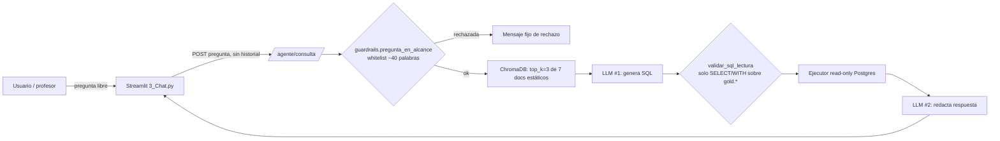

# Diagnóstico y plan de mejora — Agente FARO (chat conversacional)

> → [[vault/15_ML_Models/_index]] · [[vault/15_ML_Models/Agente_Guardrails_US304a]] · [[vault/15_ML_Models/Widget_Chat_US305]]

**Contexto:** el profesor probó el chat y lo calificó de "basura". La expectativa es un chat
**tipo Copilot de verdad**: lenguaje natural libre, memoria de la conversación, y respuestas
útiles sobre cualquier dato del proyecto. Este documento resume el diagnóstico técnico y el plan
completo de mejora — **sin restricción de fecha**, priorizado por impacto, no por urgencia de
demo. La v1 (2026-09-09 temprano) estaba acotada a "qué alcanzamos hoy"; esta v2 cubre todo lo
necesario para que el chat cumpla la expectativa completa, incluyendo lo que antes se dejó para
"después".

**Estado (2026-09-10):** Fase 1 implementada y **validada con el LLM real** (Anthropic + ChromaDB +
Postgres locales). Los 5 casos de prueba pasaron: fix de Nuevo León confirmado (genera el join
correcto `cve_ent`/`grano`/`modelo`), vocabulario libre sin palabras exactas aceptado por el
respaldo semántico del RAG, pregunta conceptual respondida sin SQL, pregunta fuera de cobertura
(Oaxaca) explicada como límite de diseño en vez de error, y la orden de escritura rechazada. 61/61
pruebas propias en verde, `ruff` limpio. Pendiente: ajustar `AGENTE_RAG_UMBRAL_DISTANCIA` con más
preguntas si aparecen falsos negativos, y coordinar con Alejandro el redeploy — **ojo:** el esquema
de ChromaDB en producción está horneado en la imagen del sidecar (no se indexa en runtime), así que
el nuevo chunk de cobertura geográfica necesita reconstruir esa imagen, no solo la de la API. Fase 2
(Karla) y Fase 3 (Alejandro) siguen pendientes de arrancar.

## Resumen ejecutivo — qué vamos a conseguir

| Hoy | Después del plan |
|---|---|
| Rechaza preguntas libres que no usan ~40 palabras exactas de una whitelist | Entiende lenguaje natural libre, con una puerta de alcance semántica en vez de una lista fija |
| No sabe explicar por qué "no hay datos" para un estado fuera de cobertura | Explica sus límites reales (solo 4 entidades, solo lectura de `gold.*`) en vez de fallar en silencio |
| Un bug conocido hace que "riesgo en Nuevo León" responda mal aunque los datos existen | Ese bug queda diagnosticado y corregido, con más contexto/ejemplos para que el texto-a-SQL acierte más seguido |
| Si el SQL generado falla, se rinde y muestra un error genérico | Reintenta automáticamente devolviendo el error al LLM (auto-corrección) antes de rendirse |
| Fuerza una consulta SQL incluso para preguntas conceptuales ("¿qué es SIN_DATO?") | Responde directo desde el contexto del proyecto cuando no hace falta tocar la base de datos |
| Cada pregunta es independiente; no recuerda lo que se preguntó antes | Sostiene una conversación real, con memoria del hilo, como un chat de verdad |
| Responde todo de golpe tras varios segundos de espera "muda" | Va mostrando la respuesta mientras se genera (streaming), como Copilot/ChatGPT |
| Cualquier falla se ve igual ("no disponible"), difícil saber qué pasó | Errores distinguibles (fuera de alcance / sin datos / timeout) + registro para detectar problemas antes de que los vea el profesor |
| Nadie del equipo puede probar el agente con el LLM real en su máquina | Entorno local reproducible + batería de ~20-30 preguntas "golden" para detectar regresiones antes de cada demo |

**Resultado final:** un chat que responde en español, sobre cualquier pregunta razonable
relacionada con los datos del proyecto (escuelas, riesgo, drivers, recomendaciones, metodología),
sosteniendo una conversación y con la misma sensación de fluidez que Copilot o ChatGPT — dentro
del límite de seguridad que el proyecto necesita (solo lectura, solo `gold.*`, solo las 4
entidades en alcance). Eso último no se elimina: es la arquitectura de seguridad del proyecto, no
una limitación a resolver.

## 1. Cómo funciona hoy (resumen del pipeline)

Cada pregunta es **independiente y sin memoria**: el front no manda historial, la API no lo
acepta (`AgenteConsultaIn` solo tiene `pregunta`), y una pregunta de seguimiento ("¿y en
Jalisco?") nunca llega ni al RAG ni al LLM — se rechaza antes con un mensaje fijo.

**Buenas noticias:** producción (`faro-api-eanzfglvyq-uc.a.run.app`) sí está viva y conectada
(LLM Anthropic + ChromaDB sidecar + ejecutor read-only). En el QA pre-demo del 8 de septiembre,
4 de 5 preguntas reales funcionaron con SQL y datos genuinos.

## 2. Hallazgos (por severidad)

| # | Severidad | Hallazgo | Evidencia | Por qué importa |
|---|---|---|---|---|
| 1 | 🔴 Alto | Guardrail de alcance = whitelist rígida de ~40 palabras (`src/agente/guardrails.py`) | `PALABRAS_AMBITO` exige un token exacto; sin sinónimos ("colegios", "peligro", "alumnado") | Causa más probable de "no responde nada": rechaza preguntas libres válidas |
| 2 | 🔴 Alto | Cero contexto conversacional real | `AgenteConsultaIn` solo tiene `pregunta`; el cliente HTTP nunca manda historial; `servicio.py` rechaza preguntas referenciales con mensaje fijo | Un chat "tipo Copilot" debe sostener conversación; hoy cada pregunta debe ser 100% autocontenida |
| 3 | 🔴 Alto | Sin streaming: la respuesta se muestra completa hasta que terminan las 2 llamadas al LLM en serie | `src/api/v1/agente.py` devuelve un JSON completo, no un stream | Un Copilot real muestra texto mientras se genera; hoy hay una espera "muda" de varios segundos que se siente lento/roto |
| 3b | 🔴 Alto | Sin auto-corrección de SQL: si la consulta generada falla (columna/tabla mal referenciada), no hay reintento con el error devuelto al LLM | `src/agente/servicio.py::procesar_consulta` ejecuta una sola vez, sin ciclo de reintento | Cualquier pregunta libre que dispare un SQL con un error menor termina en el mensaje genérico de "no disponible", en vez de autocorregirse |
| 3c | 🔴 Alto | Sin respuesta directa para preguntas conceptuales: el pipeline siempre intenta generar y ejecutar SQL, incluso para preguntas que no necesitan tocar la base de datos | `procesar_consulta` no tiene rama para responder solo desde el contexto RAG | Preguntas como "¿cómo se calcula el índice de riesgo?" o "¿qué significa SIN_DATO?" pueden rebotar en el guardrail de SQL ("sin tabla de Gold") en vez de responderse directo |
| 4 | 🟠 Medio-Alto | Bug confirmado: "riesgo en Nuevo León" responde "no hay datos" aunque existen 6,404 filas reales (verificado contra Postgres) | QA log 2026-09-08 | El LLM genera un SQL que filtra mal la entidad; exactamente el tipo de pregunta libre que puede repetir el profesor |
| 5 | 🟠 Medio | El esquema RAG nunca menciona la cobertura real de datos (solo 4 entidades: CDMX, Edomex, NL, Jalisco) | Los 7 chunks de `indexar_esquema.py` no mencionan `SCOPE_ENTIDADES`; el `SYSTEM_PROMPT` tampoco | Preguntar por otro estado da "no hay datos" sin explicar que es alcance limitado por diseño |
| 6 | 🟠 Medio | Retrieval RAG angosto y estático: 7 documentos fijos, `top_k=3`, sin ejemplos de SQL (few-shot) | `src/agente/recuperacion.py`, `src/agente/indexar_esquema.py` | Preguntas que cruzan 3+ tablas, o que requieren un patrón de JOIN no obvio, generan SQL incorrecto por falta de contexto/ejemplos |
| 7 | 🟠 Medio | Latencia al límite: 2 llamadas LLM en serie + embeddings, cerca de los 15s de timeout del cliente incluso con Haiku | QA 2026-09-08 (D2 y SIN_DATO cerca del límite) | Preguntas más complejas pueden mostrar error rojo genérico por timeout |
| 8 | 🟡 Medio-Bajo | Mensajes de error genéricos que esconden la causa real | `src/api/v1/agente.py` | Difícil saber en vivo si un fallo es guardrail, LLM o dato faltante |
| 9 | 🟡 Bajo-Medio | Sin pruebas end-to-end con LLM real en CI | `tests/test_agente_*` usan stubs | Cambios al prompt/RAG no se validan contra el comportamiento real antes de desplegar |
| 10 | 🟡 Bajo | No hay forma de probar localmente con LLM real todavía | Falta `ANTHROPIC_API_KEY` local (vive en Secret Manager, la gestiona Luis) | Bloquea iterar rápido sobre el hallazgo #4 y sobre cualquier cambio de prompt/RAG |
| 11 | 🟢 Bajo | `docker-compose.yml` no reenvía variables del agente al contenedor `api` | Solo afecta desarrollo local, no producción | Ralentiza el ciclo de prueba local del equipo |

## 3. Plan de mejora — por fases, sin fecha fija

Ya no hay presión de "la demo es hoy", así que el plan se organiza por **fases de valor** en vez
de urgencia. Cada fase deja el chat en un estado mejor y demostrable; no hace falta esperar a que
termine todo el plan para que se note la mejora.

### Fase 1 — Que entienda lenguaje libre y sea transparente

| Acción | Dónde | Esfuerzo | Responsable |
|---|---|---|---|
| Reemplazar la whitelist rígida por una puerta híbrida: vocabulario ampliado **+** señal semántica (si el RAG recupera contexto de Gold con buena similitud, se acepta aunque no matchee una palabra exacta) | `src/agente/guardrails.py`, `src/agente/servicio.py` | Medio | Andrés |
| Documentar la cobertura real de datos (4 entidades) como chunk RAG + reforzar el `SYSTEM_PROMPT` para que explique la limitación en vez de decir solo "no hay datos" | `src/agente/indexar_esquema.py`, `src/agente/prompt.py` | Bajo | Andrés |
| Diagnosticar y corregir el SQL de "Nuevo León" (pedir logs de Cloud Run o acceso al LLM real) | `src/agente/prompt.py` / contexto RAG `dim_municipio`↔`predicciones` | Medio | Andrés (logs: Alejandro) |
| Subir `top_k` de 3 a 5-7 y enriquecer los chunks del esquema con más detalle de joins típicos | `src/agente/recuperacion.py`, `src/agente/indexar_esquema.py` | Bajo | Andrés |
| Agregar ejemplos few-shot de preguntas→SQL al prompt (los casos que hoy fallan o son ambiguos) | `src/agente/prompt.py` | Medio | Andrés |
| Ciclo de auto-corrección: si `ejecutar_sql` falla, devolver el error al LLM (acotado a 1-2 reintentos) para que regenere el SQL antes de degradar al mensaje genérico | `src/agente/servicio.py`, `src/agente/llm.py` | Medio | Andrés |
| Rama de respuesta directa sin SQL: si la pregunta es conceptual/metodológica (no requiere datos de Gold), responder solo con el contexto RAG recuperado, sin forzar `generar_sql`/`ejecutar_sql` | `src/agente/servicio.py`, `src/agente/prompt.py` | Medio | Andrés |

### Fase 2 — Que sea una conversación de verdad (memoria)

| Acción | Dónde | Esfuerzo | Responsable |
|---|---|---|---|
| Agregar `historial` (lista de turnos previos, acotada a N mensajes) opcional a `AgenteConsultaIn` | `src/api/schemas.py` | Bajo | Karla (dueña de `src/api/**`) |
| Cablear el envío del historial desde el widget de chat (ya existe `st.session_state["mensajes_agente"]`, solo falta mandarlo) | `src/frontend/agente_client.py`, `src/frontend/pages/3_Chat.py` | Bajo-Medio | Andrés (frontend en alcance amarillo) |
| Pasar el historial recibido como `contexto_conversacional` a `procesar_consulta` (el soporte interno **ya existe** en `servicio.py`/`prompt.py`, solo falta que le llegue algo real) | `src/api/v1/agente.py` | Bajo | Karla |
| Definir una política de poda de historial (cuántos turnos, cuántos tokens) para no disparar costo/latencia | `src/agente/prompt.py` | Bajo | Andrés |

### Fase 3 — Que se sienta responsivo (streaming)

| Acción | Dónde | Esfuerzo | Responsable |
|---|---|---|---|
| Streaming del LLM redactor (2.ª llamada) usando `client.messages.stream(...)` de Anthropic | `src/agente/llm.py` | Medio | Andrés |
| Endpoint de streaming (`StreamingResponse`/SSE) para `/agente/consulta` o una variante nueva | `src/api/v1/agente.py` | Medio | Karla (contrato nuevo) |
| Consumir el stream en el widget (`st.write_stream` de Streamlit) en vez de esperar la respuesta completa | `src/frontend/pages/3_Chat.py` | Medio | Andrés |
| Nota: la 1.ª llamada (generar SQL) **no puede** transmitirse en streaming útil al usuario — solo se transmite la redacción final. El indicador de "pensando/consultando datos" cubre la 1.ª etapa. | — | — | — |

### Fase 4 — Robustez y observabilidad (para que no se vuelva a romper en silencio)

| Acción | Dónde | Esfuerzo | Responsable |
|---|---|---|---|
| Distinguir mensajes de error (fuera de alcance / sin datos / timeout / LLM caído) sin filtrar detalle sensible | `src/api/v1/agente.py` | Bajo-Medio | Karla |
| Logging estructurado de rechazos de guardrail y errores del LLM (sin secretos, sin SQL de usuarios en texto plano si es sensible) | `src/agente/servicio.py`, `src/api/v1/agente.py` | Bajo | Karla (código) + Alejandro (Cloud Logging) |
| Set de pruebas de regresión de texto-a-SQL contra el LLM real (manual/programado, no en CI por costo) — expandir de 5 a ~20-30 preguntas "golden" | `tests/test_agente_*`, nuevo script en `src/agente/` | Medio | Andrés |
| Arreglar el reenvío de env vars del agente al contenedor `api` en local/despliegue (`docker-compose.yml` o su override) para que cualquiera del equipo pueda probar con LLM real | `docker-compose.yml` / `docker-compose.override.yml` | Bajo | Alejandro (dueño de `docker-compose.yml`) |

## 4. Cómo se ve el resultado final

Con las 4 fases completas, el chat:
- Entiende preguntas libres en español sobre escuelas, riesgo, drivers, recomendaciones y
  cobertura de datos, sin depender de una lista fija de palabras.
- Sostiene una conversación con memoria del hilo ("¿y esas mismas escuelas en el driver D4?").
- Responde con streaming, como cualquier chat moderno (Copilot, ChatGPT).
- Explica sus límites reales (cobertura de 4 entidades, solo lectura de Gold) en vez de fallar en
  silencio.
- Tiene una red de pruebas contra el LLM real que detecta regresiones como la de Nuevo León antes
  de que las vea el profesor.

Sigue habiendo un límite **de diseño, no técnico**: por seguridad, el agente solo lee `gold.*` —
nunca va a poder hablar de bronze/silver ni de estados fuera de las 4 entidades del proyecto. Eso
no es una limitación a resolver, es la arquitectura de seguridad (defensa en profundidad:
guardrails + SQL validado + rol de solo lectura).

## 5. Equipo de trabajo

Este esfuerzo lo llevan directamente **tres personas**, no las células completas:

- **Andrés (yo):** dueño de `src/agente/**` — guardrails, RAG, prompt, auto-corrección,
  streaming del LLM, pruebas "golden". También toca `src/frontend/**` (alcance amarillo) para
  cablear historial y consumir streaming en el widget, ya que no hay nadie más de frontend en
  este trío.
- **Karla (`src/api/**`):** dueña del contrato de la API — el campo `historial` en
  `AgenteConsultaIn`, el endpoint/contrato de streaming, y mensajes de error distinguibles en
  `src/api/v1/agente.py`.
- **Alejandro (`docker/**`, `docker-compose.yml`, infra):** dueño del despliegue — reenviar las
  variables de entorno del agente al contenedor `api`, redeploy de la imagen a Cloud Run cada vez
  que cambie `src/agente/**`, y logging en Cloud Logging.

No hace falta esperar a nadie más fuera de este trío para completar las 4 fases del plan.
